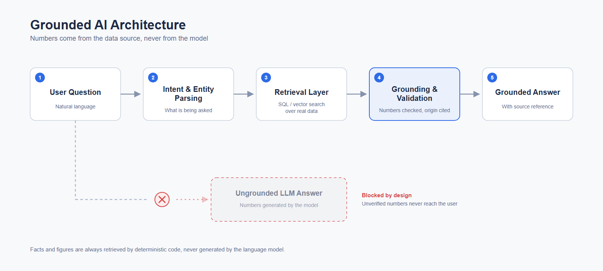

# Grounded AI Architecture

A grounded AI architecture (also called an anti-hallucination architecture) delivers business answers you can trust: every number is retrieved from the data source and verified by code, never generated by the language model.




## Problem

Large language models generate plausible but wrong numbers. In business data workflows this is unacceptable: a revenue figure that is off by 12% still reads as confident, well-formatted prose, and nobody notices until a decision has already been made on top of it.

## Architecture

The diagram above shows the reference flow, and why each layer closes a door that hallucination could walk through:

1. **User question.** Plain natural language, no query syntax required from the user.
2. **Intent and entity parsing.** The LLM is used for what it is good at: understanding what is being asked and about which entities. Its output here is a structured request, not an answer, so there is no number for it to invent.
3. **Retrieval layer.** Deterministic code (SQL queries, vector search) fetches the actual records from the client's real data. Every figure that will appear in the answer originates in this step, produced by code paths that either return real data or fail loudly.
4. **LLM drafts the answer.** The model writes the response text using only the retrieved records. It is responsible for the wording, but it is never the source of the numbers.
5. **Grounding and validation.** Before anything reaches the user, each number in the drafted answer is checked against the retrieved records and its origin is attached. A figure that cannot be traced back to the source does not pass.
6. **Answer with source reference.** The user gets the answer plus where it came from, so every claim is auditable.

The blocked path at the bottom of the diagram is the shortcut this architecture forbids: the model answering directly with numbers it generated itself. The LLM can still make mistakes while drafting the answer, and that is exactly why validation exists as a mandatory gate in the flow: any number that cannot be traced back to the source never reaches the user.

When validation rejects a number, the answer is not delivered in a degraded form. The system either reruns retrieval or tells the user explicitly that it could not verify the figure, exposing the failure instead of masking it.

## When to use

- **BI assistants:** natural language questions over dashboards and warehouses, where a wrong KPI is worse than no answer.
- **Chat with your data:** internal tools that let non-technical teams query databases and documents conversationally.
- **Report automation:** generated narratives (weekly summaries, client reports) where every stated figure must match the underlying tables.

## Example stack

Python for the orchestration and validation layers, SQL against the system of record, vector search for unstructured context (RAG), and an LLM API for intent parsing and answer wording. The pattern is provider-agnostic: any capable LLM works, because the model is never the source of facts.

For a working implementation of this pattern, see [chat-with-your-data-demo](https://github.com/rodrigojunqueiradev/chat-with-your-data-demo).

## Regenerating the diagrams

The PNG files are rendered from the SVG source with Playwright:

```
pip install playwright
playwright install chromium
python diagram/render.py
```

## About

Reference architecture by [Rodrigo Junqueira](https://github.com/rodrigojunqueiradev), Data Analyst & AI Automation Specialist. Educational/demonstration material.

## License

MIT
